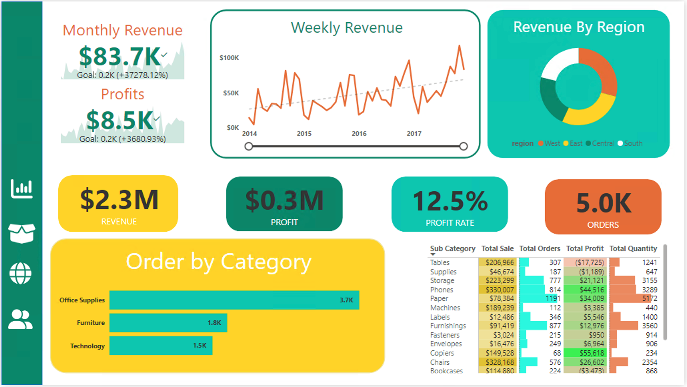
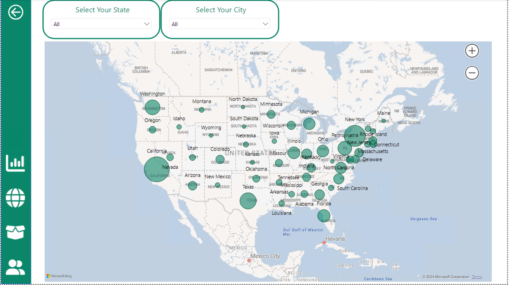
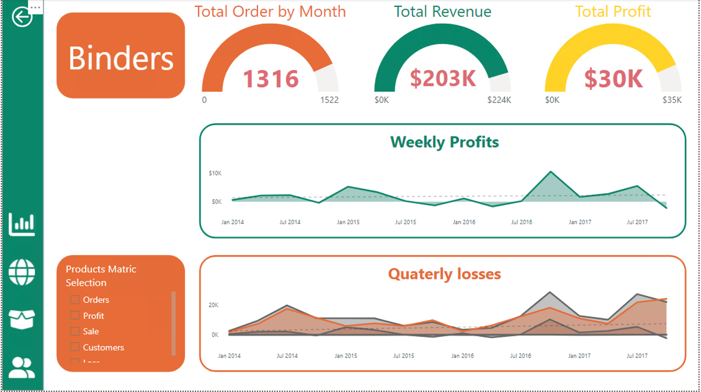
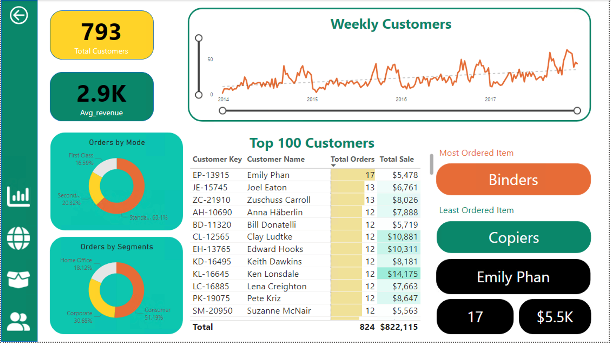

# 💹 Supermarket Sales Data Analysis and Visualization

This repository contains an analysis of supermarket sales data. The dataset has been cleaned and pre-processed using Python, and Power BI has been used to create insightful visualizations.

## Table of Contents

- [Overview](#overview)
- [Dataset](#dataset)
- [Data Cleaning](#data-cleaning)
- [Exploratory Data Analysis (EDA)](#exploratory-data-analysis-eda)
- [Visualizations](#visualizations)
- [KPIs](#kpis)
- [How to Use](#how-to-use)
- [Technologies Used](#technologies-used)

## Overview

The goal of this project is to explore and analyze a supermarket sales dataset. The analysis focuses on cleaning and preparing the data for visualization, followed by generating visual insights in Power BI. Key performance indicators (KPIs) such as total sales, profit, revenue, and product performance are displayed through intuitive charts and dashboards.

## Dataset

The dataset used for this project contains 9,986 rows and 22 columns. Each row represents a unique sale transaction, with attributes such as:

- Order ID, Date, and Shipping Date
- Customer Information (ID, Name, Segment)
- Product Information (Category, Sub-category, Product Name)
- Sales, Quantity, Profit, Discount
- Region and Shipping Mode

**Note:** The dataset was cleaned and transformed before loading into Power BI.

## Data Cleaning

The following steps were taken to clean and prepare the dataset:

1. **Renamed Columns**: Replaced spaces with underscores and converted to lowercase for consistency (e.g., `order_date`, `ship_mode`, etc.).
2. **Datetime Conversion**: Converted columns like `order_date` and `ship_date` into datetime formats for accurate time-based analysis.
3. **Handled Duplicates**: Checked for duplicate rows and eliminated them.
4. **Removed Timezone Information**: Timezone data was removed from datetime columns where it showed `00:00:00`.
5. **Filled Missing Values**: Handled missing or incomplete data appropriately.

## Exploratory Data Analysis (EDA)

Exploratory Data Analysis was carried out in Python using the following techniques:

- **Univariate Analysis**: Analyzed key columns like `sales`, `profit`, `discount`, and `quantity` using descriptive statistics and visual plots.
- **Correlation Analysis**: Investigated relationships between numerical columns to understand how factors like `discount` affect `profit`.

The cleaned dataset was exported to a `.parquet` file and imported into Power BI for further analysis.

## Visualizations

Power BI was used to create dynamic and interactive visualizations, including:

1. **Total Sales and Profit Overview**: Displayed total sales and total profit generated by different product categories, regions, and customer segments.
2. **Monthly Revenue**: Visualized monthly revenue trends over time.
3. **Top Performing Products**: Identified the products that contribute most to sales and profit.
4. **Discount Impact on Sales**: Analyzed how discounts affect profit margins.
5. **Geographical Analysis**: Created a map to show sales distribution across regions and cities.

### Key Visualizations:

- **Bar Charts**: Represented total sales and profit per region and product category.
- **Line Graphs**: Showed monthly trends for sales and profit.
- **Heatmap**: Displayed the correlation between various features such as sales, profit, discount, and quantity.
- **KPIs**: Highlighted key metrics like total sales, total profit, and average revenue per customer.

## KPIs

The following Key Performance Indicators were created in Power BI:

- **Total Sales**: The sum of sales across all transactions.
- **Total Profit**: Profit calculated as revenue minus cost.
- **Profit Margin**: Calculated using the formula: `Profit Margin = (Total Profit / Total Sales) * 100`.
- **Revenue Growth**: Compared revenue over different time periods.
- **Average Revenue per Customer**: Total revenue divided by the number of unique customers.

## How to Use

1. Clone the repository:
   ```bash
   git clone https://github.com/your-username/supermarket-sales-analysis.git
   ```

## Power BI Dashboard:

### Main Dashboard



## Map Details



## Product Details



## Customers Details



# Thank You!
